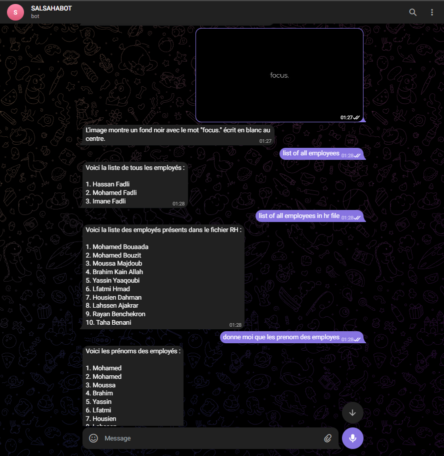
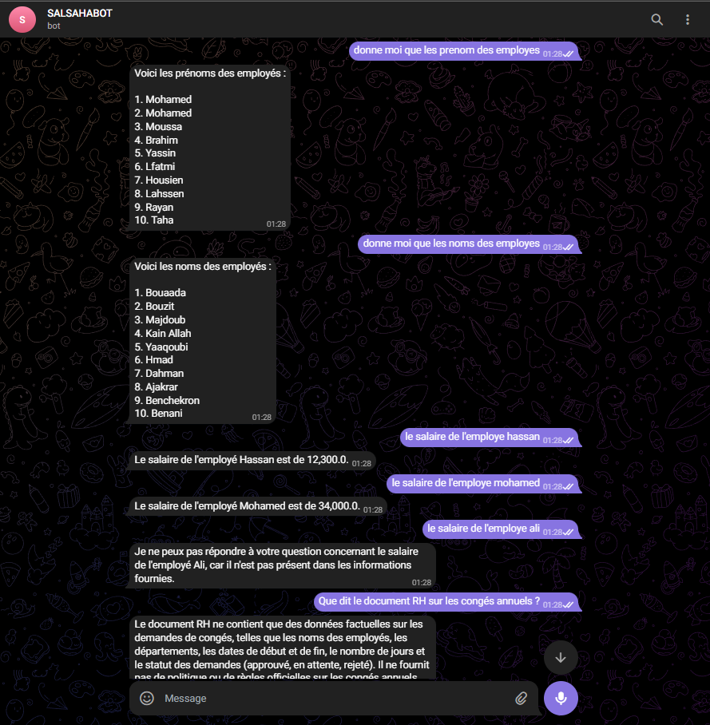
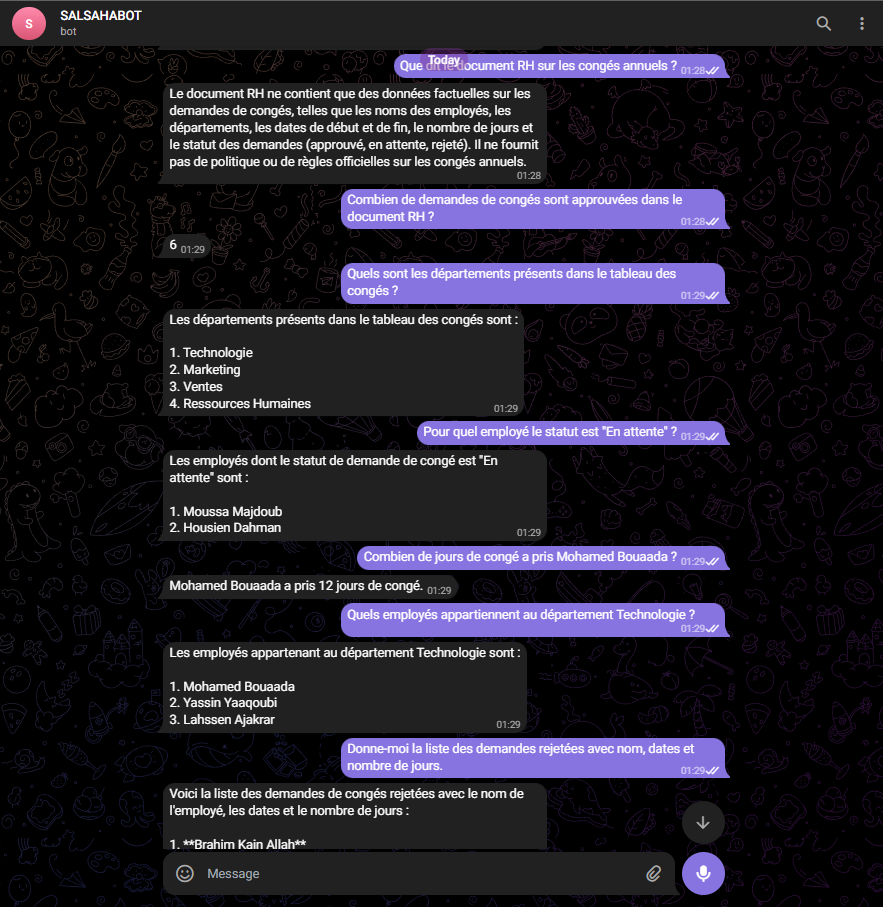
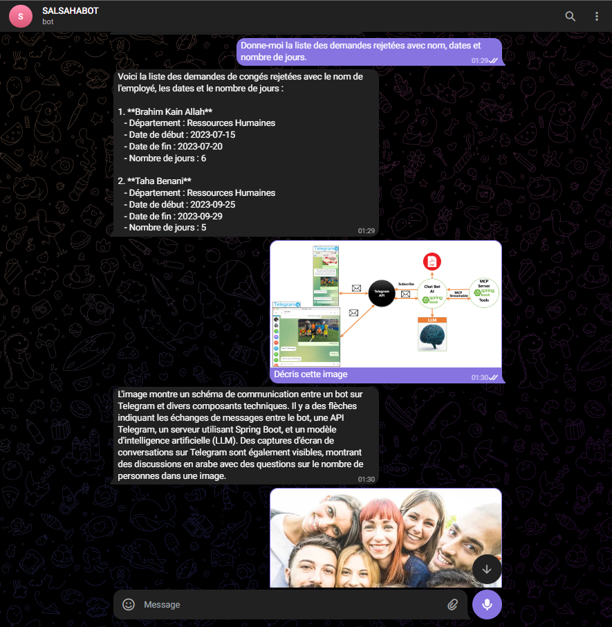
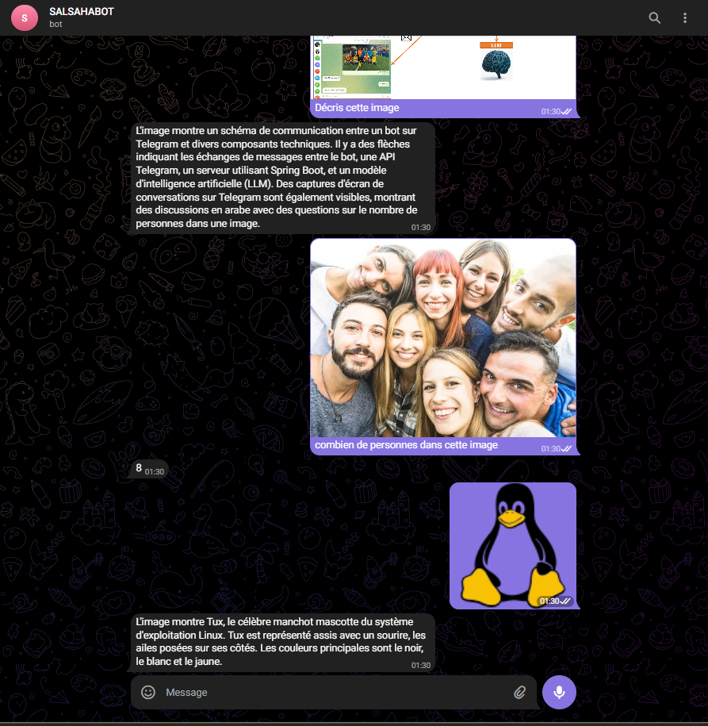

# SALSAHABOT - AI-Powered Telegram Bot
**Author: LAMBARAA Abdellah**

```markdown
**Chatbot** is a sophisticated application built with **Spring Boot 3.5** and **Spring AI**. It serves as an intelligent HR assistant, capable of processing text, analyzing images, and retrieving information from HR documents using RAG (Retrieval-Augmented Generation).
```

## 🚀 Key Features

- **OpenAI GPT-4o Integration**: High-quality natural language processing for conversation and problem-solving.
- **Multimodal Capabilities**:
  - **Image Description**: Send an image, and the bot will provide a detailed description.
  - **Counting**: Ask the bot "Combien..." followed by an image, and it will count objects for you.
- **RAG (Retrieval-Augmented Generation)**:
  - Answers questions based on private HR documents (PDF, text).
  - Uses an in-memory Vector Store for fast and efficient retrieval.
- **HR Assistant Specialized**:
  - Accesses employee databases via specialized tools (`getEmployee`, `getAllEmployee`).
  - Follows strict HR privacy and behavioral rules.
- **Interactive Interface**: Uses Telegram's long-polling mechanism for real-time interaction.

## 🛠️ Technical Stack

- **Java 21**
- **Spring Boot 3.5.7**
- **Spring AI (1.1.0-M4)**: OpenAI, Vector Stores, Document Readers.
- **TelegramBots Spring Boot Starter (6.9.7.1)**
- **Maven**: Project management and build tool.

## 📋 Prerequisites

Before you begin, ensure you have the following installed:
- [Java Development Kit (JDK) 21+](https://www.oracle.com/java/technologies/downloads/)
- [Apache Maven](https://maven.apache.org/download.cgi)
- A Telegram account and a Bot Token from [@BotFather](https://t.me/botfather).
- An OpenAI API Key.

## ⚙️ Configuration

Update your `src/main/resources/application.properties` with your credentials:

```properties
spring.ai.openai.api-key=YOUR_OPENAI_API_KEY
telegram.api.key=YOUR_TELEGRAM_BOT_TOKEN
```

*Note: The bot uses `gpt-4o` by default and runs on port `8091`.*

## 🏃 How to Run

1. **Clone the repository**:
   ```bash
   git clone <repository-url>
   cd telegram-bot
   ```

2. **Build the project**:
   ```bash
   mvn clean install
   ```

3. **Run the application**:
   ```bash
   mvn spring-boot:run
   ```

## 📸 Screenshots & Resultats

### Résultat du projet après exécution :






## 📄 License

This project is licensed under the MIT License - see the [LICENSE](LICENSE) file for details.